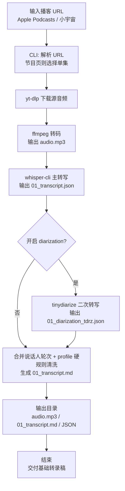

# 本地播客转录工作流

把 Apple Podcasts / 小宇宙链接转成可读的播客转录稿。

这个仓库当前聚焦一条本地 CLI 流程：

- 本地下载音频、转 MP3、Whisper 转录、说话人轮次排版、硬规则清洗

## 快速入口

- 中文 CLI 说明：[`scripts/README.podcast_workflow.zh.md`](scripts/README.podcast_workflow.zh.md)
- `whisper.cpp` 原始构建/能力文档：[`README.whispercpp.md`](README.whispercpp.md)

## 项目能做什么

输入一个播客链接，CLI 会完成：

1. 解析 Apple Podcasts / 小宇宙单集或节目页链接
2. 下载音频并转为 `audio.mp3`
3. 调用本地 `whisper-cli` 生成 `01_transcript.json`
4. 可选调用本地 `tinydiarize` 生成说话人分离 JSON
5. 把转录结果整理成按对话轮次排版的 `01_transcript.md`
6. 按 `profile` 应用说话人名称、术语替换和噪声短语过滤

说明：

- 当前工作流按 `Speaker A / Speaker B` 两位对谈场景设计
- 本地 `tinydiarize` 主要提供二人轮次提示
- 如需进一步润稿，请基于 `01_transcript.md` 自行做人工或模型后处理

## 完整工作流程图



## 一条命令得到转录稿

### 1. clone 仓库

```bash
git clone https://github.com/kongdada/podcast-transcriber.git
cd podcast-transcriber
```

### 2. 编译 `whisper-cli`

```bash
cmake -B build
cmake --build build -j --config Release
```

### 3. 安装依赖

macOS:

```bash
brew install yt-dlp ffmpeg
```

Ubuntu:

```bash
sudo apt update
sudo apt install -y ffmpeg python3-pip
python3 -m pip install -U yt-dlp
```

### 4. 下载模型

主转写模型：

```bash
./models/download-ggml-model.sh large-v3-turbo
```

说话人分离模型：

```bash
curl -fL "https://huggingface.co/akashmjn/tinydiarize-whisper.cpp/resolve/main/ggml-small.en-tdrz.bin" \
  -o ./models/ggml-small.en-tdrz.bin \
  || curl -fL "https://hf-mirror.com/akashmjn/tinydiarize-whisper.cpp/resolve/main/ggml-small.en-tdrz.bin" \
  -o ./models/ggml-small.en-tdrz.bin
```

### 5. 运行脚本

```bash
python3 scripts/podcast_workflow.py --url "<podcast-url>"
```

示例：

```bash
python3 scripts/podcast_workflow.py \
  --url "https://www.xiaoyuzhoufm.com/episode/69a64629de29766da93331ec"
```

## 默认输出

每次运行会创建一个新的 `outputs/<run-id>/` 目录，默认保留：

```text
outputs/20260321-123456-某期标题/
  audio.mp3
  01_transcript.md
  01_transcript.json
  01_diarization_tdrz.json   # 仅在开启 diarization 时生成
```

默认不生成：

- `01_transcript.srt`
- `01_transcript.txt`

说明：

- `01_transcript.md` 是基础标准稿，适合直接阅读
- `01_transcript.json` 和说话人分离 JSON 会默认保留，供人工复核或后续自定义处理复用
- `run_manifest.json` 只在 `--keep-json-artifacts` 时保留

## 对谈稿格式

`01_transcript.md` 默认会：

- 合并连续同一说话人的片段
- 说话人切换时空一行
- 长段按标点智能断行
- 单行目标长度控制在约 `100` 字

如果已知说话人名字，可直接覆盖 `Speaker A/B`：

```bash
python3 scripts/podcast_workflow.py \
  --url "https://www.xiaoyuzhoufm.com/episode/69a64629de29766da93331ec" \
  --speaker-a-name "张潇雨" \
  --speaker-b-name "雨白"
```

## profile 机制

`scripts/podcast_profiles/` 下的 JSON 配置可以固化节目级规则：

- `speaker_a_name`
- `speaker_b_name`
- `noise_phrases`
- `replacements`
- URL / 标题匹配规则

参考：

- [`scripts/podcast_profiles/README.md`](scripts/podcast_profiles/README.md)
- [`scripts/podcast_profiles/_template.profile.json`](scripts/podcast_profiles/_template.profile.json)

## 常见命令

节目页非交互指定集数：

```bash
python3 scripts/podcast_workflow.py \
  --url "<show-url>" \
  --episode-index 1
```

关闭说话人分离：

```bash
python3 scripts/podcast_workflow.py --url "<podcast-url>" --no-diarization
```

保留 `run_manifest.json`：

```bash
python3 scripts/podcast_workflow.py --url "<podcast-url>" --keep-json-artifacts
```

## 依赖与排错

脚本会在启动时检查：

- `yt-dlp`
- `ffmpeg`
- `whisper-cli`
- ASR 模型文件
- `tinydiarize` 模型文件（当开启 diarization 时）

常见问题：

1. 缺少 `ggml-small.en-tdrz.bin`
   按上面的 `curl` 命令下载，或临时使用 `--no-diarization`
2. 节目页在非交互环境失败
   显式加 `--episode-index`
3. 想要更顺畅、但忠实原文的清洗版
   当前仓库只产出基础稿 `01_transcript.md`，建议基于该文件自行做人工或模型后处理

## 相关文档

- CLI 详细说明：[`scripts/README.podcast_workflow.zh.md`](scripts/README.podcast_workflow.zh.md)
- 归档的 `whisper.cpp` 文档：[`README.whispercpp.md`](README.whispercpp.md)
