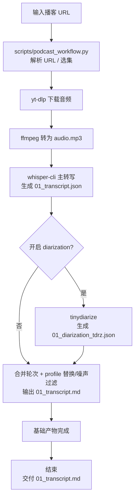

# 播客下载与转录工作流（中文说明）

本文档面向 CLI 使用场景：clone 项目后，输入一个播客链接，得到一份基础转录稿 `01_transcript.md`。

脚本入口：`scripts/podcast_workflow.py`

## CLI 负责什么

脚本会自动完成：

1. 解析 Apple Podcasts / 小宇宙链接
2. 下载音频并转码为 MP3
3. 用本地 `whisper.cpp` 生成 `01_transcript.json`
4. （默认）运行 `tinydiarize` 生成说话人分离 JSON
5. 合并轮次，输出对谈稿格式的 `01_transcript.md`
6. 应用 `profile` 中的说话人名称、噪声短语和术语替换

脚本不负责语义清洗。当前仓库默认只产出基础稿 `01_transcript.md`。

说明：

- 当前工作流按 `Speaker A / Speaker B` 两位对谈场景设计
- `tinydiarize` 主要提供二人轮次提示

## 完整工作流程图



## 从零开始

### 1) clone 并进入目录

```bash
git clone https://github.com/kongdada/podcast-transcriber.git
cd podcast-transcriber
```

### 2) 编译 `whisper-cli`

```bash
cmake -B build
cmake --build build -j --config Release
```

### 3) 安装依赖

macOS:

```bash
brew install yt-dlp ffmpeg
```

Ubuntu:

```bash
sudo apt update
sudo apt install -y ffmpeg python3-pip
python3 -m pip install -U yt-dlp
```

### 4) 下载模型

主转写模型：

```bash
./models/download-ggml-model.sh large-v3-turbo
```

说话人分离模型：

```bash
curl -fL "https://huggingface.co/akashmjn/tinydiarize-whisper.cpp/resolve/main/ggml-small.en-tdrz.bin" \
  -o ./models/ggml-small.en-tdrz.bin \
  || curl -fL "https://hf-mirror.com/akashmjn/tinydiarize-whisper.cpp/resolve/main/ggml-small.en-tdrz.bin" \
  -o ./models/ggml-small.en-tdrz.bin
```

### 5) 一条命令转录

```bash
python3 scripts/podcast_workflow.py --url "<podcast-episode-url>"
```

示例：

```bash
python3 scripts/podcast_workflow.py \
  --url "https://www.xiaoyuzhoufm.com/episode/69a64629de29766da93331ec"
```

## 输出结果

每次运行会生成一个新目录，例如：

```text
outputs/20260321-123456-某期标题/
  audio.mp3
  01_transcript.md
  01_transcript.json
  01_diarization_tdrz.json
```

说明：

- `01_transcript.md`：基础可读稿
- `01_transcript.json`：主转写结构化结果，默认保留
- `01_diarization_tdrz.json`：说话人分离结构化结果，默认保留
- 默认不生成 `01_transcript.srt`、`01_transcript.txt`
- `run_manifest.json` 仅在 `--keep-json-artifacts` 时保留

如果启用了 `--no-diarization`，则不会生成 `01_diarization_tdrz.json`。

## 对谈稿格式

默认会把连续的同一位说话人合并成一段，格式类似：

```text
张潇雨（00:12:01 - 00:12:48）：
……

雨白（00:12:48 - 00:13:10）：
……
```

长段落会按标点自动断行，默认单行目标长度约 `100` 字。

如已知两位说话人的名字，可直接替换 `Speaker A/B`：

```bash
python3 scripts/podcast_workflow.py \
  --url "https://www.xiaoyuzhoufm.com/episode/69a64629de29766da93331ec" \
  --speaker-a-name "张潇雨" \
  --speaker-b-name "雨白"
```

## profile 用法

如需使用 profile（说话人名、噪声词、术语替换）：

```bash
python3 scripts/podcast_workflow.py \
  --url "<podcast-episode-url>" \
  --profile my-show
```

参考：

- [`scripts/podcast_profiles/README.md`](podcast_profiles/README.md)
- [`_template.profile.json`](podcast_profiles/_template.profile.json)

## 节目页（多集）用法

节目页链接会交互列出最近 10 集。若在非交互环境运行，请显式指定集数：

```bash
python3 scripts/podcast_workflow.py \
  --url "<show-url>" \
  --episode-index 1
```

## 常用参数

- `--url`：必填，播客链接
- `--episode-index`：节目页选择第几集（1-based）
- `--out-root`：输出目录根路径（默认 `./outputs`）
- `--profile`：显式指定 profile 名称或 JSON 文件路径
- `--profile-dir`：profile 目录（默认 `./scripts/podcast_profiles`）
- `--whisper-bin`：`whisper-cli` 路径（默认 `./build/bin/whisper-cli`）
- `--asr-model`：主转写模型路径（默认 `./models/ggml-large-v3-turbo.bin`）
- `--gpu` / `--no-gpu`：开启/关闭 GPU 加速（默认开启）
- `--keep-awake` / `--no-keep-awake`：运行时防休眠（macOS 默认开启）
- `--progress-interval`：进度心跳打印间隔秒数（默认 `30`）
- `--keep-json-artifacts` / `--no-keep-json-artifacts`：是否保留 `run_manifest.json` 等调试产物（默认不保留）
- `--diarization` / `--no-diarization`：开启/关闭说话人分离（默认开启）
- `--speaker-a-name`：为 `Speaker A` 指定展示名
- `--speaker-b-name`：为 `Speaker B` 指定展示名
- `--tdrz-model`：说话人分离模型路径（默认 `./models/ggml-small.en-tdrz.bin`）
- `--language`：转录语言（默认 `zh`）
- `--threads`：线程数（默认 `8`）

## 常见问题

1. 报错缺少 `ggml-small.en-tdrz.bin`
使用上面的 `curl` 命令下载，或临时使用 `--no-diarization`。

2. 节目页在非交互环境失败
加上 `--episode-index`。

3. 只想要纯转写，不要说话人分离
加 `--no-diarization`。

4. 想把节目术语、噪声词固化下来
在 `scripts/podcast_profiles/` 下创建 profile。
